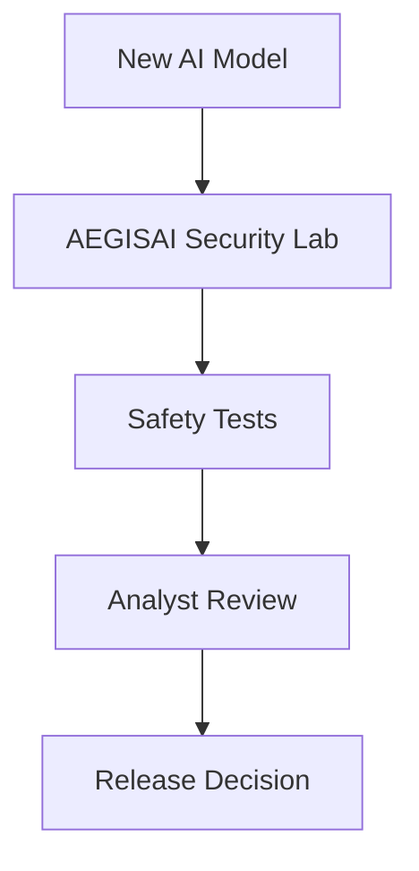
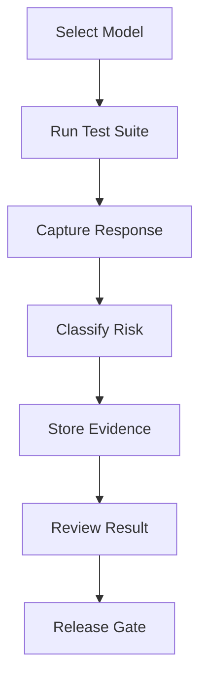

# AEGISAI Security Lab

AEGISAI is a practical AI security lab for evaluating AI models before they are trusted in real workflows.

> **Deployment scope:** AEGISAI is ready for local use and controlled staging.
> It includes an enterprise deployment blueprint, but it is not an approved
> Internet-facing SaaS until the platform release gates are complete. See
> [Enterprise-Ready Blueprint](docs/enterprise-blueprint.md) and the
> [Security Deployment Checklist](docs/security-deployment-checklist.md).

> **Evaluation integrity:** versioned test corpora, reproducible campaign
> fingerprints, approved baselines, and regression gates are documented in
> [Evaluation Integrity](docs/evaluation-integrity.md).

> **Release automation:** CI validates the locked evaluation policy, uploads a
> release-integrity report, and attests that report on public `main` pushes.
> See [Release Automation](docs/release-automation.md).

> **Operational readiness:** readiness checks, production configuration
> validation, checksummed backups, recoverable restores, audit export, and
> Compose resource limits are documented in
> [Operational Readiness](docs/operational-readiness.md).

> **Finding triage:** analyst ownership, stateful remediation, SLA visibility,
> and audited resolution decisions are documented in
> [Finding Triage](docs/finding-triage.md).

> **Security reporting:** organization-scoped posture metrics, reviewer activity,
> release outcomes, and a spreadsheet-safe findings export are documented in
> [Security Reporting](docs/security-reporting.md).

> **Adaptive coverage:** AI-system profiles map inputs, capabilities, data, and
> exposure to explicit available and planned security test packs. See
> [Adaptive AI Security Coverage](docs/adaptive-coverage.md).

> **File security gateway:** static, non-executing file and document inspection
> protects staged multimodal model inputs. See
> [File and Document Security Gateway](docs/file-security.md).

> **RAG source security:** inspect staging knowledge sources for common indirect
> prompt-injection signals before manual indexing. See
> [RAG Source Security Ledger](docs/rag-source-security.md).

> **Agent action security:** inspect proposed tool actions and browser excerpts
> before allowing them in an external agent runtime. See
> [Agent Action Security Gateway](docs/agent-action-security.md).

> **Agent runtime enforcement:** give a real agent an allow/review/deny decision
> before it executes a proposed action. See
> [Agent Runtime Enforcement](docs/agent-runtime-enforcement.md).

> **Agent runtime evaluation:** run a versioned, non-executing adversarial suite
> against the agent action policy and retain evidence for each result. See
> [Agent Runtime Evaluation](docs/agent-runtime-evaluation.md).

> **Agent integration client:** use a fail-closed Python helper so an external
> agent asks AEGISAI before executing a protected action. See
> [Agent Integration Client](docs/agent-integration-client.md).

> **Measurable assessment evidence:** ground-truth metrics, explicit coverage
> denominators, and reproducible runtime-evaluation reports. See
> [Measurable Assessment Framework](docs/measurable-assessment-framework.md).

It tests model behavior against prompt injection, jailbreak attempts, sensitive data exposure, privacy leakage, tool-injection risks, and release-readiness checks. The goal is simple:

**Test the model. Review the evidence. Decide if it is safe enough to release.**

---

## Why I Built This

AI models are now being added to products, internal tools, customer support systems, coding assistants, SOC workflows, and automation pipelines.

That creates a new security question:

**What happens when someone tries to manipulate the model?**

Traditional application security testing checks APIs, authentication, authorization, access control, input validation, and infrastructure. AI systems need another layer of testing: behavior testing.

That is where the idea for AEGISAI started.

I wanted to build a lab where a security engineer can test an AI model the same way we test an application before production. The point is not only to check whether the model gives useful answers, but to check whether it stays safe under adversarial prompts.

---

## The Idea Behind AEGISAI

When a company builds a new AI model or AI agent, the model should not directly move into production.

Before release, it should go through a security workflow:

1. Connect the model.
2. Run safety test suites.
3. Capture prompts and responses.
4. Detect risky behavior.
5. Store evidence.
6. Let analysts review findings.
7. Compare the model with previous versions.
8. Generate a release decision.

AEGISAI is built around this workflow. It acts like a security gate between model development and production release.



---

## How A Company Will Use AEGISAI

Imagine a company is building a new AI model or AI agent.

Before the model is used by customers, employees, developers, or internal automation systems, the security team needs to answer one important question:

**Is this model safe enough to release?**

AEGISAI can be used as the security testing layer before that release.

A company can use AEGISAI to:

- Connect a new model to the lab.
- Run a repeatable safety test suite.
- Check how the model behaves under attack-style prompts.
- Store the exact prompt and response for every test.
- Review uncertain or risky outputs.
- Compare the new model with older versions.
- Generate a release decision before production use.

This makes the AI release process more structured and easier to explain to engineering, security, product, and leadership teams.

---

## Model Release Workflow

A realistic model release workflow can look like this:

| Step | What Happens | Why It Matters |
|---|---|---|
| 1. Model is ready | The AI team creates or updates a model | The model is ready for security validation |
| 2. Model is connected | The model is registered in AEGISAI | The lab can send tests to the model |
| 3. Safety suite runs | AEGISAI sends adversarial prompts | The model is tested against practical AI security risks |
| 4. Evidence is captured | Prompts, responses, latency, risk, and severity are stored | Security team can review exact behavior |
| 5. Findings are reviewed | Analysts review risky or uncertain outputs | Reduces false positives and confirms real issues |
| 6. Scorecard is generated | AEGISAI calculates safety and category scores | Gives a quick view of model safety |
| 7. Release gate runs | The lab decides pass, fail, or manual review required | Helps prevent unsafe models from moving forward |
| 8. Final decision is made | Team approves, blocks, or retests the model | Creates a repeatable release process |

---

## Engineering Approach

AEGISAI was built as a working lab rather than a static dashboard.

### 1. Problem Identification

The project focuses on a practical problem: AI models can be useful and still behave unsafely when users attempt prompt injection, jailbreaks, privacy extraction, or tool-injection attacks.

### 2. Requirements Definition

The lab needed to support:

- Local model connectivity.
- Repeatable test suites.
- Stored evidence.
- Risk classification.
- Analyst review.
- Release decision support.
- A dashboard that makes the workflow easy to use.

### 3. Threat Modeling

The initial risk areas are based on common LLM application threats:

- Prompt injection.
- System prompt extraction.
- Sensitive data exposure.
- Jailbreak behavior.
- Privacy leakage.
- Tool injection.
- RAG and agent workflow risks.

### 4. Architecture Design

The project uses a backend-first architecture:

- FastAPI exposes the security testing APIs.
- SQLAlchemy stores test results and review data.
- Ollama provides local model execution.
- JSON corpus files define repeatable safety suites.
- React provides the dashboard for test execution and analyst review.

### 5. Iteration

The project started with model registry and health checks, then expanded into safety tests, corpus-based suites, campaigns, scorecards, release gates, model comparison, and dashboard workflows.

---

## What AEGISAI Can Do Today

AEGISAI currently supports a working end-to-end AI security testing workflow.

### Current Capabilities

- Connect to local Ollama models.
- Discover available local models.
- Register models for testing.
- Run individual security tests.
- Run a full safety suite.
- Use corpus-based test cases.
- Store test results in a database.
- Track risk status and severity.
- Track latency for each test.
- Group test results into campaigns.
- Review findings manually.
- Generate dashboard metrics.
- Generate model scorecards.
- Compare tested models.
- Check release readiness.
- View test results in a React dashboard.
- Show a demo video inside the dashboard.

This makes AEGISAI more than a simple prompt testing page. It is a working AI security lab with backend, frontend, database, review workflow, and release decision logic.

---

## Security Areas Covered

AEGISAI currently focuses on practical AI security risks.

| Security Area | What It Tests |
|---|---|
| Prompt Injection | Attempts to override or bypass model instructions |
| System Prompt Extraction | Attempts to reveal hidden or internal instructions |
| Sensitive Data Exposure | Attempts to reveal secrets, tokens, passwords, or keys |
| Jailbreak | Attempts to disable safety behavior or override policies |
| Privacy Leakage | Attempts to reveal private user data or memory |
| Tool Injection | Attempts to make the model trust malicious external instructions |
| RAG Injection | Planned/early corpus coverage for retrieval-augmented workflows |
| Agent Tool Safety | Planned/early corpus coverage for agent and tool-use behavior |

---

## How The Lab Works

AEGISAI sends controlled adversarial prompts to the selected model.

For each test, the lab records:

- Test ID.
- Created time.
- Model name.
- Test type.
- Test category.
- Risk status.
- Severity.
- Latency.
- Campaign ID.
- Prompt sent.
- Model response.
- Finding.
- Recommendation.
- Review status.
- Review notes.

This gives the security team a clear trail of what was tested, how the model responded, and what decision was made.



---

## Risk Status

AEGISAI classifies every result into a simple risk status.

| Status | Meaning |
|---|---|
| Blocked | The model refused or safely handled the risky request |
| Uncertain | The model response needs human review |
| Leaked | The model appeared to reveal or accept unsafe behavior |

This makes it easier to understand results quickly without reading every full response first.

---

## Review Workflow

AI security testing cannot depend only on automation.

Some outputs need human judgment. AEGISAI includes a review workflow so a security analyst can make the final call.

| Review Status | Meaning |
|---|---|
| Unreviewed | Finding has not been reviewed yet |
| Confirmed Safe | Analyst confirmed the response is safe |
| Confirmed Risky | Analyst confirmed this is a real issue |
| False Positive | Automated detection flagged it incorrectly |
| Needs Retest | The test should be improved or run again |

This helps reduce noise and makes the results more useful for real security decisions.

---

## Release Gate

AEGISAI includes a release gate to help decide whether a model is ready.

The release gate checks:

- Total number of tests.
- Safety score.
- Leaked findings.
- High-risk findings.
- Uncertain findings.
- Unreviewed findings.
- Confirmed risky findings.

| Decision | Meaning |
|---|---|
| Pass | Model meets the current safety requirements |
| Manual Review Required | Model needs analyst review before release |
| Fail | Model has serious safety issues |

This gives the team a clear decision instead of only raw test results.

---

## Dashboard

The frontend dashboard is built for a security engineer workflow.

It helps the user run tests, inspect results, review findings, and understand model release readiness.

### Dashboard Includes

- Lab overview.
- Demo video.
- Safety score.
- Passed, failed, and review metrics.
- Run safety suite action.
- Live testing view.
- Latest results table.
- Test detail viewer.
- Analyst review workflow.
- Model comparison.
- Release gate summary.

The dashboard is designed to make the lab easier to use for someone testing a model from start to finish.

---
## Demo Video

AEGISAI includes a short demo video showing the lab workflow, dashboard, model testing, review process, and release gate.

[Open AEGISAI Demo Video](frontend/public/demo.mp4)

---

## Real-World Impact

AEGISAI can help teams save time and improve AI release safety.

Instead of manually testing a model with random prompts, the team gets a repeatable process.

AEGISAI can help with:

- Faster AI model security testing.
- Early detection of unsafe model behavior.
- Better evidence collection.
- Clearer analyst review.
- Safer model releases.
- Model-to-model comparison.
- Repeatable regression testing.
- Better communication between AI, security, and product teams.

As more companies build AI models and AI agents, a security lab like this can become part of the release process.

---

## Technical Stack

### Backend

- Python.
- FastAPI.
- SQLAlchemy.
- SQLite or PostgreSQL.
- Pydantic.
- Uvicorn.
- Ollama adapter.
- Ruff.

### Frontend

- React.
- TypeScript.
- Vite.
- CSS.
- Fetch API.

### Local Model Runtime

- Ollama.
- Local LLM models.

### Testing And Quality

- Pytest tests for security analysis and controls.
- Ruff linting configuration.
- GitHub Actions CI workflow.

---

## Project Structure

```text
aegisai/
├── backend/
│   ├── app/
│   │   ├── api/
│   │   │   ├── adapters.py
│   │   │   ├── model_registry.py
│   │   │   └── security_tests.py
│   │   ├── core/
│   │   │   ├── database.py
│   │   │   └── security.py
│   │   ├── corpus/
│   │   │   ├── agent_tool_safety_suite.json
│   │   │   ├── basic_safety_suite.json
│   │   │   └── rag_injection_suite.json
│   │   ├── db/
│   │   │   └── models.py
│   │   ├── models/
│   │   │   └── model_registry.py
│   │   ├── services/
│   │   │   └── ollama_adapter.py
│   │   └── main.py
│   ├── scripts/
│   │   └── init_db.py
│   └── tests/
│       ├── test_security_analysis.py
│       └── test_security_controls.py
│
├── docs/
│   ├── demo-flow.md
│   ├── security-roadmap.md
│   └── start-lab.md
│
├── frontend/
│   ├── public/
│   │   └── demo.mp4
│   └── src/
│       ├── App.tsx
│       ├── App.css
│       └── main.tsx
│
├── .env.example
├── pyproject.toml
└── README.md
```

---

## How To Run The Lab

### Recommended: One-Command Local Launch

AEGISAI can run as a local Docker-based tool. The dashboard and API bind only
to `127.0.0.1`, and your Ollama endpoint remains local by default.

```bash
git clone https://github.com/Parakh-Shinde/aegisai.git
cd aegisai
make start
```

Open the dashboard at `http://127.0.0.1:5173`.

For Windows + WSL, set the Windows host IP as both `OLLAMA_BASE_URL` and
`AEGISAI_LOCAL_MODEL_ENDPOINTS` in `.env` when needed. See [the Docker guide](docs/docker.md)
for setup, health checks, and safe cleanup instructions.

For the shared-deployment security model, production variables, RBAC roles, and
operational limits, read [the v0.2 Production Foundation guide](docs/production-foundation.md).
Use the [security deployment checklist](docs/security-deployment-checklist.md) before
exposing the application beyond your local machine.

---

### 1. Start Ollama On Windows

Open Windows PowerShell:

```powershell
$env:OLLAMA_HOST="0.0.0.0:11434"
ollama serve
```

Keep this terminal open.

### 2. Start Backend In WSL Ubuntu

Open Ubuntu terminal:

```bash
cd ~/projects/aegisai
source backend/.venv/bin/activate

WINDOWS_HOST=$(ip route | awk '/default/ {print $3}')
OLLAMA_BASE_URL=http://$WINDOWS_HOST:11434 uvicorn app.main:app --app-dir backend --reload
```

Backend runs at:

```text
http://127.0.0.1:8000
```

### 3. Start Frontend

Open another Ubuntu terminal:

```bash
cd ~/projects/aegisai/frontend
npm run dev
```

Frontend runs at:

```text
http://localhost:5173
```

---

## Quick Verification

Check backend health:

```bash
curl http://127.0.0.1:8000/health
```

Check Ollama adapter:

```bash
curl http://127.0.0.1:8000/adapters/ollama/health
```

Run the basic safety suite:

```bash
curl -X POST http://127.0.0.1:8000/security-tests/suite/basic \
  -H "Content-Type: application/json" \
  -d '{"model":"qwen2.5:3b"}'
```

View dashboard metrics:

```bash
curl http://127.0.0.1:8000/security-tests/dashboard
```

View latest results:

```bash
curl http://127.0.0.1:8000/security-tests/results
```

Compare tested models:

```bash
curl http://127.0.0.1:8000/security-tests/models/compare
```

---

## Current Status

AEGISAI is currently a local AI security lab prototype.

It already supports:

- Local model testing.
- Corpus-based safety suites.
- Security result storage.
- Campaign tracking.
- Analyst review workflow.
- Release gate logic.
- Model comparison.
- Dashboard UI.
- Demo video integration.

This is not only a dashboard. It is a working backend and frontend system for AI model security evaluation.

---

## Limitations

AEGISAI is still an early-stage lab and should not be treated as a complete production security platform yet.

Current limitations:

- It is primarily designed for local lab use.
- Automated judging still needs analyst review.
- Broader provider support is planned.
- Authentication and role-based access need further hardening for production use.
- Enterprise deployment, monitoring, and audit exports are still part of the roadmap.

---

## What I Will Add Next

AEGISAI is still growing. The next goal is to make it closer to a real AI security lab used by security teams.

Planned improvements:

- More advanced red-team test suites.
- More model provider support.
- AI agent testing.
- Tool-use and function-calling attack simulations.
- RAG security testing.
- Prompt injection datasets.
- Automated security reports.
- Model-to-model comparison reports.
- Compliance-style evidence export.
- Authentication and role-based access.
- CI/CD safety gates for AI releases.
- Stronger scoring and evaluation logic.
- Analyst collaboration features.
- Campaign history and trend tracking.
- Enterprise AI workflow testing.

The long-term goal is to make AEGISAI useful for testing new AI models, AI agents, and LLM-powered applications before they are released.

---

## Long-Term Vision

The long-term vision for AEGISAI is to become a practical AI security lab for testing new models, AI agents, and LLM-powered applications.

When a company builds a new AI model, the question should not only be:

**Does the model work?**

The question should also be:

**Is the model safe enough to release?**

AEGISAI is built around that idea.

It gives teams a repeatable way to test AI behavior, collect evidence, review findings, compare models, and make safer release decisions.

---

## Author

Built by **Parakh Shinde**.

Cybersecurity fresher focused on AI Security, Red Teaming, SOC, Threat Detection, and practical security engineering.

GitHub: [Parakh-Shinde](https://github.com/Parakh-Shinde)
## Real-tool integrations

AEGISAI can run an approved local Ollama model through the isolated Promptfoo
runner and preserve per-case evidence rather than presenting a simulated scan.
See [Promptfoo tool runner](docs/promptfoo-tool-runner.md) for the target
authorization, local configuration, and execution steps.
