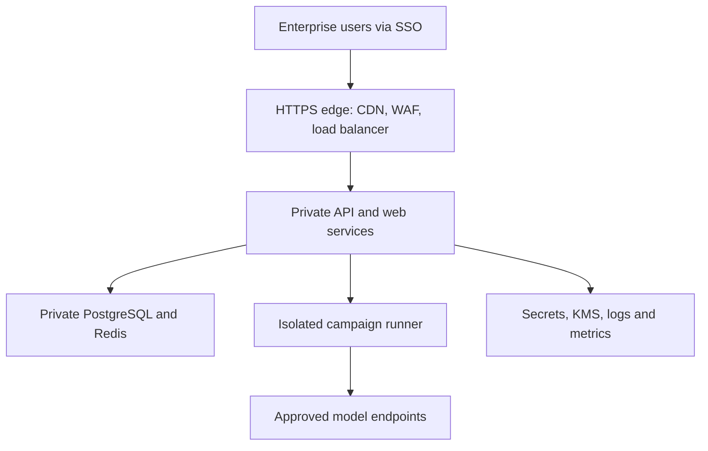

# Enterprise-Ready Blueprint

## Purpose and honest scope

AEGISAI is currently a local and controlled-staging AI security evaluation lab.
This blueprint describes the controls required before an Internet-facing,
customer-data deployment. It does **not** claim that the repository is already
an enterprise SaaS and it intentionally creates no cloud resources.

## Target architecture



The frontend and API are separate services. PostgreSQL, Redis, and workers are
never public. The campaign runner is a separate, short-lived workload with a
smaller permission set than the API.

## Required production controls

| Area | Required implementation | AEGISAI status |
|---|---|---|
| Identity | OIDC/SAML SSO, MFA, deprovisioning, scoped service accounts | Design required; local JWT/RBAC already exists |
| Tenant isolation | Organization filter on every record/query plus authorization tests | Implemented foundation; needs external pen-test validation |
| Secrets | Managed secret store, KMS encryption, rotation, no secrets in Git | Required outside local Compose |
| Network | Private workloads, HTTPS edge, WAF, restrictive security groups | Terraform blueprint added; not deployed |
| Data | Managed PostgreSQL, encryption, backup retention and restore drills | Application migrations exist; platform work required |
| Campaign safety | Per-job isolated runner, quotas, no Docker socket, explicit egress allowlist | Required before untrusted workloads |
| Observability | Central structured logs, metrics, traces, alerts, immutable audit export | Required |
| Supply chain | Protected branches, signed images/SBOM, dependency and image scans | CI foundation exists; release governance required |

## Production release gates

Do not expose AEGISAI publicly until all of the following have evidence:

1. A threat model and data-flow review were approved.
2. SSO/MFA is enabled for all privileged users.
3. The database, Redis, API, and workers have no public network path.
4. Secrets come from a managed store and have rotation owners.
5. Campaign workers are isolated per job and have time, memory, concurrency,
   payload, and outbound-network limits.
6. A restore test proves encrypted database backups can be recovered.
7. Monitoring/alerting and an incident-response owner are in place.
8. A staging deployment passes authorization, tenant-boundary, and abuse tests.
9. An independent penetration test closes critical/high findings.

## Zero-cost development workflow

Use Docker Compose for local work and GitHub Actions for continuous checks:

```bash
make doctor
make lint
make test
git status
```

Terraform is included only for formatting and configuration validation; it is
not applied. The local Compose stack must remain loopback-only.

## Safe portfolio wording

Use this wording in a resume, LinkedIn project entry, or README:

> Designed and implemented an enterprise-ready AI security evaluation platform
> with multi-tenant RBAC, encrypted evidence, asynchronous campaign execution,
> Dockerized services, CI security checks, and a validated Infrastructure-as-Code
> deployment blueprint.

Do not state that AEGISAI is deployed as an enterprise SaaS or that it has been
independently penetration-tested unless that later becomes true.
