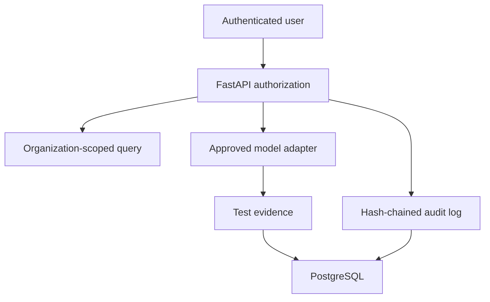

# v0.2 Production Foundation

v0.2 establishes the security boundary for a shared AEGISAI deployment. It is a
foundation, not a declaration that every future scale or compliance requirement is
complete.

## Included controls

| Area | v0.2 control |
|---|---|
| Identity | Password hashing with Argon2, short-lived signed JWTs, and first-admin bootstrap token |
| Roles | Admin, Security Analyst, and Viewer permissions enforced at API routes |
| Tenancy | Every model, test result, campaign-derived query, and audit event is scoped to one organization |
| Database | PostgreSQL through Docker Compose; Alembic owns the schema lifecycle |
| Auditability | Hash-chained, organization-scoped audit events for sign-in, model registration, test runs, reviews, and deletion |
| Model connectivity | Local endpoints by default; remote endpoints require an exact environment allowlist |
| API hardening | Bounded Pydantic inputs, restrictive CORS origins, security response headers, pagination limits, and sanitized upstream errors |
| Supply chain | CI runs Ruff, pytest, frontend lint/build, dependency audit, secret scan, and filesystem vulnerability scan |

## Authorization matrix

| Capability | Admin | Security Analyst | Viewer |
|---|---:|---:|---:|
| View organization data | Yes | Yes | Yes |
| Register models and run tests | Yes | Yes | No |
| Review findings | Yes | Yes | No |
| Read audit logs | Yes | No | No |
| Delete evidence | Yes | No | No |

Administrators create Security Analyst and Viewer accounts with `POST /auth/users`.
That endpoint can create accounts only in the caller's organization.

## Data flow

## Deployment requirements

Production must set `AEGISAI_ENVIRONMENT=production`, which refuses to start unless
authentication is enabled and the JWT secret is at least 32 characters. Keep all
secrets in your platform's secret manager and inject them as environment variables;
never commit `.env` or expose secrets through the frontend.

Terminate TLS at a trusted reverse proxy, set the CORS allowlist to the deployed UI
origin, keep API ports private, and configure backups plus restore tests. Model
providers need a dedicated secret-management adapter before hosted-provider keys are
introduced; v0.2 deliberately accepts no provider API key in API or UI payloads.

## Retention and incident response

Evidence can contain sensitive prompts and responses. Define an organization-level
retention schedule before onboarding production data, minimize inputs, restrict
database backup access, and delete data only through a documented retention job.
For a suspected credential or evidence exposure: revoke affected credentials,
preserve audit logs, contain access, identify impacted organizations, notify owners
under the applicable policy, and record corrective actions.

## Next production milestones

1. Encrypt sensitive evidence with customer-managed or platform-managed keys and
   add a tested retention/deletion worker.
2. Move campaigns to a Redis-backed worker queue with per-organization concurrency,
   payload, timeout, and egress limits.
3. Version corpora and scoring rules; make release approval an explicit immutable
   workflow with false-positive and false-negative feedback.
4. Add OpenTelemetry tracing, metrics, alerts, external backup verification, and a
   formal threat-model review.
