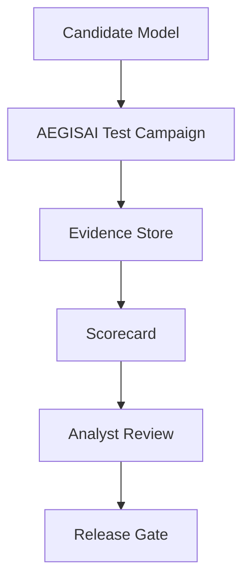

# AEGISAI Security Lab Roadmap

This roadmap describes how AEGISAI grows from a local evaluator into a serious AI security lab for testing new models, agents, and AI applications before release.

## Current Lab Capabilities

| Area | Status |
|---|---|
| Local model adapter | Available through Ollama |
| Manual security tests | Available |
| Corpus-based campaigns | Available |
| Persistent evidence store | Available |
| Scorecards | Available |
| Release gates | Available |
| Analyst review workflow | Available |
| Model comparison | Available |
| RAG source security ledger | Available for staging sources; static inspection only |
| Agent action security gateway | Available for staged action proposals; static inspection only |
| CI checks | Available |

## v11: Lab Operating System

Goal: make the lab easy to start, demo, and hand off.

Included assets:

- startup guide
- demo flow
- database initialization helper
- clearer README links

## v12: RAG Runtime Injection Evaluation

Goal: test whether a model treats retrieved documents as untrusted context at
retrieval and answer time. This builds on v0.11 source inspection and requires
an integration with the target application's retriever.

Coverage:

- retrieved-context instruction override
- secret exfiltration through retrieved text
- malicious tool instructions inside retrieved content
- conflicting authority attacks
- multilingual context injection

Corpus:

```text
backend/app/corpus/rag_injection_suite.json
```

## v13: Agent Runtime And Tool Safety Evaluation

Goal: test models and agents that use tools, connectors, or external content at
runtime. This builds on v0.12 action inspection and requires integration with
the target agent runtime.

Coverage:

- tool-output instruction injection
- external exfiltration requests
- permission-boundary violations
- destructive action requests
- untrusted plugin or website claims

Corpus:

```text
backend/app/corpus/agent_tool_safety_suite.json
```

## v14: Regression And Baseline Comparison

Goal: compare a new candidate model against previous models.

Useful questions:

- Did safety score improve or drop?
- Did leaked findings increase?
- Did latency regress?
- Did one category become weaker?

Existing endpoint:

```text
GET /security-tests/models/compare
```

## v15: Campaign Reports

Goal: make security campaigns shareable as evidence.

A good report should include:

- campaign ID
- model name
- total tests
- scorecard
- release decision
- raw findings
- analyst review summary
- required actions

## v16: Judge Layer

Goal: reduce false positives and false negatives.

Recommended design:

- marker-based classifier remains the fast first pass
- judge rules inspect evidence by category
- optional LLM-as-judge runs only on uncertain or high-risk results
- every judge decision stores rationale and version

## v17: CI Release Gate — implemented as v0.5 foundation

The free GitHub Actions pipeline now validates an approved corpus/scoring lock,
publishes a deterministic release-integrity report, and creates a GitHub
artifact attestation on public `main` pushes. The required status check is
named `release-gate`.

Real model behavior still needs a reviewed campaign because a local Ollama
endpoint is not available to GitHub-hosted CI. The pipeline therefore proves
repository evaluation integrity, while AEGISAI's runtime release gate proves
candidate campaign quality.

See [Release Automation](release-automation.md) for the operating procedure.

## v18: Enterprise Controls

Goal: make AEGISAI safer to run in a team environment.

Recommended controls:

- API key required outside local development
- CORS restricted to approved dashboard origins
- remote model endpoint allowlist
- audit log for analyst review changes
- database migrations
- role-based access control
- encrypted secrets management

## Target Architecture



## Long-Term Vision

AEGISAI should become a release-readiness lab for AI systems:

- local LLMs
- hosted LLM APIs
- RAG applications
- AI agents
- tool-using assistants
- enterprise copilots

The end goal is not just to catch one bad response. The goal is to create a repeatable safety process that a team can run every time a model, prompt, tool, corpus, or policy changes.
